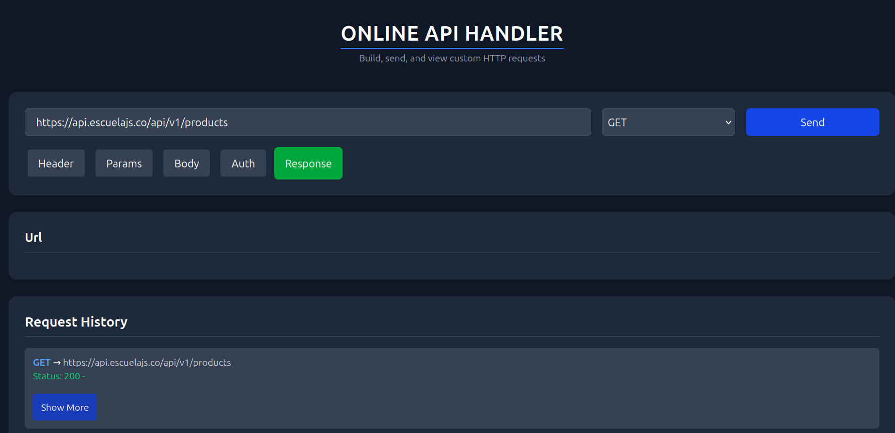
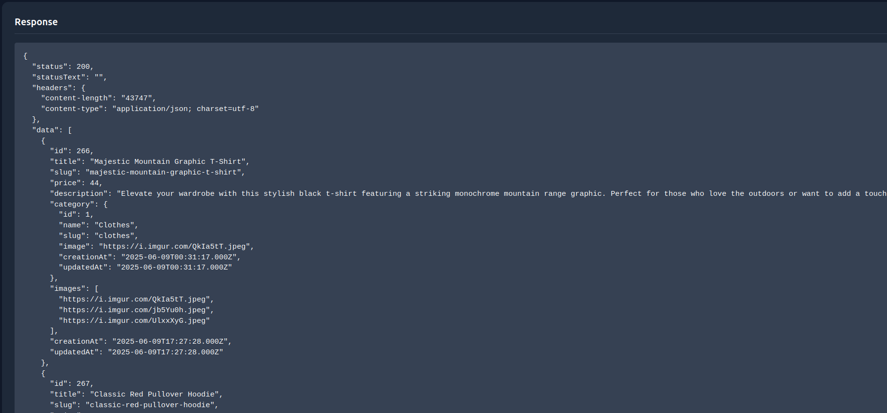
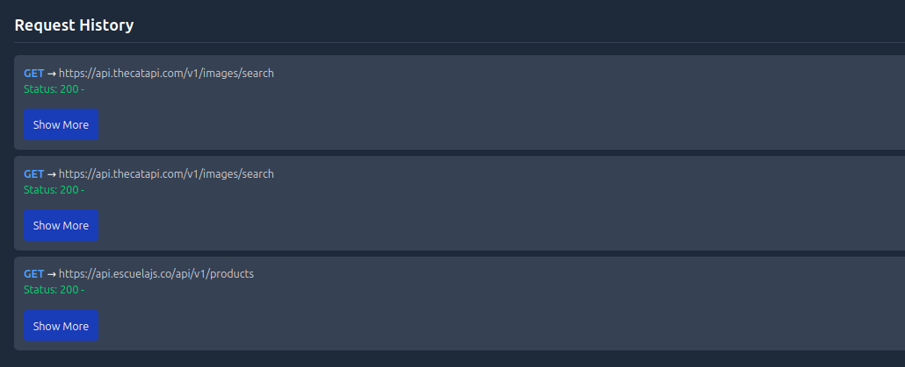

# API Handler

A developer-friendly Nuxt-based frontend tool for interacting with and testing API endpoints in real time. Designed for productivity, speed, and simplicity.

## 🚀 Features

- Simple and clean UI using Tailwind CSS
- Built with Nuxt.js and Vue.js
- Enter and hit backend API URLs directly
- Supports both all api requests
- Displays formatted JSON responses
- Helps developers test backend logic without Postman
- Stores the history of api sended
- View information about the api

## 📸 Screenshots

### 🔍 GET Request in Action

---

### 📨 Handling the response

### 📨 History of your request

## 🧰 Tech Stack

- Nuxt.js
- Vue.js
- Tailwind CSS
- JavaScript

## 🖥️ Setup and Installation

1. Clone the repository

bash
git clone https://github.com/Bully26/api_handler.git
cd api_handler
